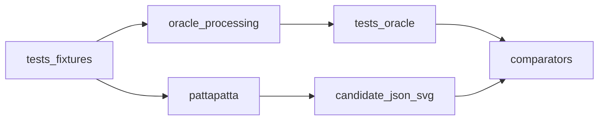

# Processing oracle CLI

## Context

Validate `pattapatta` against real PGS by running a headless Processing project from the shell that writes SVG and JSON goldens.

CLI how-to (create / edit / build / run / export, sketch layout, libraries): [processing-cli.md](../research/processing-cli.md).

## Goals

- Runnable without the Processing IDE.
- Shared fixtures with TypeScript tests.
- Export **SVG** (visual) and **JSON** (numeric) per case.
- Documented env setup for Processing 4 + Geometry Suite for Processing (PGS).

## Non-goals

- Publishing the oracle inside the npm package.
- Pixel matching of animated README GIFs.

## Options considered

### IDE-only sketches

- Poor automation.

### Headless Processing / Java main exporting files (chosen)

- Scriptable via `run-oracle.sh`.

## Proposal

### Layout

```
oracle/processing/
  README.md
  scripts/
    run-oracle.sh
  OracleMain/                 # sketch folder (name == OracleMain.pde)
    OracleMain.pde
    FixtureIO.pde
    SvgExport.pde
    BooleanCases.pde
    HatchCases.pde
    code/                     # optional PGS jar(s); gitignored *.jar
```

### CLI

```bash
./oracle/processing/scripts/run-oracle.sh --out tests/oracle --all
./oracle/processing/scripts/run-oracle.sh --out tests/oracle --suite hatch --case parallel-45
./oracle/processing/scripts/run-oracle.sh --suite boolean --compare
```

Suggested flags:

| Flag | Meaning |
|------|---------|
| `--out <dir>` | Golden root (default `tests/oracle`) |
| `--fixtures <dir>` | Input fixtures (default `tests/fixtures`) |
| `--suite <name>` | `boolean` \| `hatch` \| `packing` \| `occlusion` \| … |
| `--case <id>` | Single case id |
| `--all` | All registered cases |
| `--seed <n>` | Override RNG seed |
| `--compare` | After export, run TS candidate + comparator (optional) |

### Runtime behaviour

1. Resolve `PROCESSING_JAVA` / `PROCESSING_PATH` (documented in oracle README).
2. Ensure PGS library is on the sketch `code/` or sketchbook `libraries` path.
3. Launch with `processing cli --sketch=<abs> --run …` (see [processing-cli.md](../research/processing-cli.md); legacy: `processing-java`).
4. Sketch: `noLoop()`, load fixture, call PGS, write `<out>/<suite>/<case>.json` + `.svg`, `exit()`.

### Export rules

- JSON schema: see [pgs-comparison-harness.md](./pgs-comparison-harness.md).
- SVG: fixed `viewBox`, **stroke only** (`fill="none"`), stable stroke (`#000`, width 1), no CSS animation — plotter-oriented goldens.
- Coordinates: same world space as fixtures (no unexplained canvas offsets).
- Circles serialized as `{ "x", "y", "r" }` (PGS `PVector.z` → `r`).

### First smoke cases (Phase 1b)

| Suite | Case | PGS calls |
|-------|------|-----------|
| boolean | `union-two-rects` | `union` |
| boolean | `subtract-two-rects` | `subtract` |
| boolean | `occlusion-two-rects` | `occlusionSubtract` |
| hatch | `parallel-45-unit-square` | `parallelSegments` + `intersect` |

### Comparison wiring



## Open questions

- Whether to vendor a PGS jar under `oracle/processing/lib` or sketch `code/` (license: GPL — OK for oracle tooling, keep out of npm pack).

## Document history

| Version | Date       | Author | Summary       |
|---------|------------|--------|---------------|
| 0.1.0   | 2026-09-10 | agent  | Initial design |
| 0.2.0   | 2026-09-10 | agent  | Plotter SVG: fill none |
| 0.3.0   | 2026-09-10 | agent  | Link Processing CLI research; resolve flag open question |
| 0.4.0   | 2026-09-10 | agent  | In-repo OracleMain sketch layout |

## Next steps

- Expand packing/occlusion suites as modules land.
