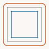

# contour

Offset curves via morphology buffers.

## Imports

```ts
import { offsetCurvesOutward, offsetCurvesInward, contour } from 'pattapatta'
```

## Functions

| Function | Description |
|----------|-------------|
| `offsetCurvesOutward(path, distance)` | Positive buffer |
| `offsetCurvesInward(path, distance)` | Erosion (may vanish) |

Advanced skeletons / medial axis are not implemented yet.

## Example



```ts
const sq = createRect(15, 15, 70, 70)
offsetCurvesOutward(sq, 8)
offsetCurvesInward(sq, 8)
```
