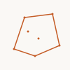

# hull

Convex hull and bounding box.

## Imports

```ts
import { convexHull, convexHullPath, boundingBox, hull } from 'pattapatta'
```

## Functions

| Function | Description |
|----------|-------------|
| `convexHull(points)` | Andrew monotone chain → polygon |
| `convexHullPath(path)` | Hull of all path vertices |
| `boundingBox(path)` | AABB as rectangle path |

## Examples

### Convex hull



### Bounding box


