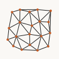
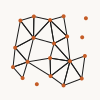

# meshing

Faces, edges, and graph filters on triangle sets.

## Imports

```ts
import {
  extractInnerEdges, extractInnerVertices, findContainingFace,
  splitEdges, gabrielFaces, relativeNeighborFaces, dualFaces,
  radialSortFaces, centroidSortFaces, areaMerge, meshing,
} from 'pattapatta'
```

## Functions

| Function | Description |
|----------|-------------|
| `extractInnerEdges(faces)` | Unique undirected edges |
| `extractInnerVertices(faces)` | Unique vertices |
| `findContainingFace(faces, point)` | First containing face |
| `splitEdges(faces, maxLen)` | Densify long edges |
| `gabrielFaces(points)` | Delaunay ∩ Gabriel |
| `relativeNeighborFaces(points)` | Delaunay ∩ RNG |
| `dualFaces(faces)` | Dual edges as open paths |
| `radialSortFaces` / `centroidSortFaces` | Order faces |
| `areaMerge(faces, minArea)` | Merge tiny faces into neighbors |

## Examples

### Mesh edges



### Gabriel faces


