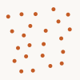

# pointSet

Point distributions and pruning.

## Imports

```ts
import {
  randomPoints, squareGrid, hexGrid, pointRing,
  poisson, prunePointsWithinDistance, pointSet,
} from 'pattapatta'
```

## Functions

| Function | Description |
|----------|-------------|
| `randomPoints(n, minX, minY, maxX, maxY, seed?)` | Uniform box samples |
| `squareGrid` / `hexGrid` | Lattices in a box |
| `pointRing(count, center, radius)` | Circle samples |
| `poisson(minDist, …, seed?)` | Bridson-style Poisson disk |
| `prunePointsWithinDistance(pts, minDist)` | Greedy thinning |

## Example — Poisson



```ts
const pts = poisson(14, 10, 10, 90, 90, 8)
```
