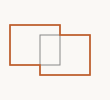
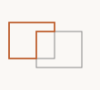

# shapeBoolean

Clipper2-backed boolean operations on closed paths.

## Imports

```ts
import {
  union, unionAll, intersect, subtract, subtractAll,
  symDifference, complement, occlusionSubtract, overlapRegions,
  shapeBoolean,
} from 'pattapatta'
```

## Functions

| Function | Description |
|----------|-------------|
| `union(a, b)` | A ∪ B |
| `unionAll(paths)` | Folded union |
| `intersect(a, b)` | A ∩ B |
| `subtract(a, b)` | A \\ B |
| `subtractAll(base, shapes)` | Sequential subtract |
| `symDifference(a, b)` | XOR |
| `complement(shape, w, h)` | `[0,w]×[0,h]` minus shape |
| `occlusionSubtract(group)` | Painter occlusion (later on top) |
| `overlapRegions(a, b)` | Overlap contours |

All return a `Group`.

## Examples

### Union

```ts
const merged = union(createRect(10, 25, 50, 40), createRect(40, 35, 50, 40))
```



### Subtract

```ts
const cut = subtract(createRect(10, 25, 50, 40), createRect(40, 35, 50, 40))
```


