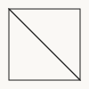
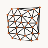

# triangulation

Polygon and point-set triangulations.

## Imports

```ts
import {
  earCutTriangulation, delaunayTriangulation,
  delaunayTriangulationPoints, triangulation,
} from 'pattapatta'
```

## Functions

| Function | Description |
|----------|-------------|
| `earCutTriangulation(path, opts?)` | Clipper2 triangulate (holes OK) |
| `delaunayTriangulation(path)` | Same with `useDelaunay: true` |
| `delaunayTriangulationPoints(points)` | d3-delaunay triangles |

## Examples

### Ear-cut square



### Point Delaunay


