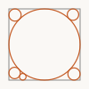

# Getting started

This page covers how to think in **pattapatta**, how imports work, and a small end-to-end plotter pipeline.

## Mental model

1. Build or load geometry as `Path` / `Group` values.
2. Transform with boolean, hatch, pack, offset, tile, …
3. Emit SVG with `toSvg` (`fill="none"`, stroked marks).

Solid area fills are **out of scope**. See [Pen-plotter output](concepts/pen-plotter.md).

## Imports

Root import (convenient):

```ts
import { polygon, vec2, union, toSvg } from 'pattapatta'
```

Feature subpaths (tree-shake friendly):

```ts
import { hatchParallel } from 'pattapatta/hatch'
import { hexLatticePack } from 'pattapatta/circlePacking'
import { buffer } from 'pattapatta/morphology'
```

## Geometry in 30 seconds

```ts
import { vec2, polygon, group, createCircle } from 'pattapatta'

const square = polygon([
  vec2(0, 0),
  vec2(1, 0),
  vec2(1, 1),
  vec2(0, 1),
])

const disk = createCircle(0.5, 0.5, 0.4, 48)
const scene = group([square, disk])
```

Read [Geometry model](concepts/geometry-model.md) for `Path`, holes, and `Group` z-order.

## Mini pipeline: cut → hatch → pack

```ts
import {
  createRect,
  subtract,
  hatchParallel,
  segmentsToOpenPaths,
  maximumInscribedPack,
  group,
  toSvg,
  polyline,
} from 'pattapatta'

const paper = createRect(0, 0, 100, 100)
const hole = createRect(30, 30, 40, 40)
const frame = subtract(paper, hole) // Group

const target = frame.paths[0]!
const hatches = segmentsToOpenPaths(
  hatchParallel(target, { spacing: 4, count: 40, angle: Math.PI / 6 }),
)
const packs = maximumInscribedPack(target, 5, 0.5)

// Circles → open rings for SVG (or emit <circle> yourself)
const circlePaths = packs.map((c) => {
  const n = 32
  const pts = Array.from({ length: n }, (_, i) => {
    const t = (i / n) * Math.PI * 2
    return { x: c.x + Math.cos(t) * c.r, y: c.y + Math.sin(t) * c.r }
  })
  return { rings: [pts], closed: true }
})

const out = toSvg(group([...hatches, ...circlePaths]), {
  viewBox: '0 0 100 100',
  strokeWidth: 0.8,
})
```



## Coordinates

There is no fixed unit. Use plotter millimetres, pixels, or normalized `[0,1]` — just keep `strokeWidth` consistent with your scale.

## TypeScript

The package ships `.d.ts` next to ESM. No extra `@types` package is required for the public API (`d3-delaunay` types are a dependency of the build).

## Regenerating doc pictures

Example SVGs in this book are produced by:

```bash
npm run docs:examples
```

That writes into `gitbook/assets/`.

## Next

Browse the [API reference](api/shape-boolean.md) — each module page includes pictured examples.
